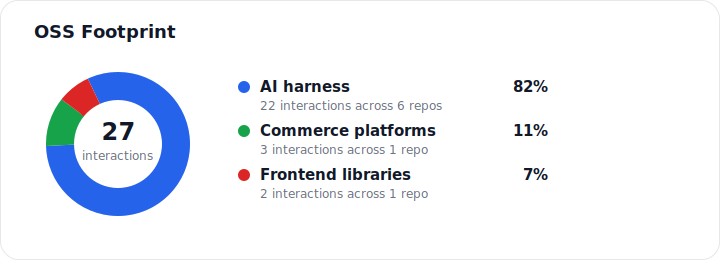

## 👋

<!--
**hcsum/hcsum** is a ✨ _special_ ✨ repository because its `README.md` (this file) appears on your GitHub profile.

Here are some ideas to get you started:

- 🔭 I’m currently working on ...
- 🌱 I’m currently learning ...
- 👯 I’m looking to collaborate on ...
- 🤔 I’m looking for help with ...
- 💬 Ask me about ...
- 📫 How to reach me: ...
- 😄 Pronouns: ...
- ⚡ Fun fact: ...
-->
Self-taught coder, working professionally since 2018.

Here to collaborate and check out some cool projects.

Say hi: hi@hcxu.cc

## Things I am paying attention to lately

<!-- OSS_FOOTPRINTS_START -->

- [`anomalyco/opencode`](https://github.com/anomalyco/opencode) 
  AI coding agents, terminal UX, plugin/runtime behavior 
  Interactions: [1 PR](https://github.com/search?q=repo%3Aanomalyco%2Fopencode%20is%3Apr%20author%3Ahcsum%20archived%3Afalse&type=issues), [4 issues](https://github.com/search?q=repo%3Aanomalyco%2Fopencode%20is%3Aissue%20author%3Ahcsum%20archived%3Afalse&type=issues), [4 comments](https://github.com/search?q=repo%3Aanomalyco%2Fopencode%20commenter%3Ahcsum%20archived%3Afalse&type=issues)
- [`mem0ai/mem0`](https://github.com/mem0ai/mem0) 
  agent memory, extraction quality, self-hosted infrastructure 
  Interactions: [1 PR](https://github.com/search?q=repo%3Amem0ai%2Fmem0%20is%3Apr%20author%3Ahcsum%20archived%3Afalse&type=issues), [2 issues](https://github.com/search?q=repo%3Amem0ai%2Fmem0%20is%3Aissue%20author%3Ahcsum%20archived%3Afalse&type=issues), [1 comment](https://github.com/search?q=repo%3Amem0ai%2Fmem0%20commenter%3Ahcsum%20archived%3Afalse&type=issues)
- [`grinev/opencode-telegram-bot`](https://github.com/grinev/opencode-telegram-bot) 
  chat-based coding workflows and permission UX 
  Interactions: [1 PR](https://github.com/search?q=repo%3Agrinev%2Fopencode-telegram-bot%20is%3Apr%20author%3Ahcsum%20archived%3Afalse&type=issues), [1 issue](https://github.com/search?q=repo%3Agrinev%2Fopencode-telegram-bot%20is%3Aissue%20author%3Ahcsum%20archived%3Afalse&type=issues), [1 comment](https://github.com/search?q=repo%3Agrinev%2Fopencode-telegram-bot%20commenter%3Ahcsum%20archived%3Afalse&type=issues)
- [`vendurehq/vendure`](https://github.com/vendurehq/vendure) 
  commerce admin UX and framework edge cases 
  Interactions: [2 issues](https://github.com/search?q=repo%3Avendurehq%2Fvendure%20is%3Aissue%20author%3Ahcsum%20archived%3Afalse&type=issues), [1 comment](https://github.com/search?q=repo%3Avendurehq%2Fvendure%20commenter%3Ahcsum%20archived%3Afalse&type=issues)
- [`eze-is/web-access`](https://github.com/eze-is/web-access) 
  browser automation, local CDP workflows, agent tooling 
  Interactions: [1 PR](https://github.com/search?q=repo%3Aeze-is%2Fweb-access%20is%3Apr%20author%3Ahcsum%20archived%3Afalse&type=issues), [2 comments](https://github.com/search?q=repo%3Aeze-is%2Fweb-access%20commenter%3Ahcsum%20archived%3Afalse&type=issues)
- [`SillyTavern/SillyTavern`](https://github.com/SillyTavern/SillyTavern) 
  AI roleplay interfaces and extensible chat UX 
  Interactions: [1 PR](https://github.com/search?q=repo%3ASillyTavern%2FSillyTavern%20is%3Apr%20author%3Ahcsum%20archived%3Afalse&type=issues), [1 comment](https://github.com/search?q=repo%3ASillyTavern%2FSillyTavern%20commenter%3Ahcsum%20archived%3Afalse&type=issues)
- [`jaredpalmer/formik`](https://github.com/jaredpalmer/formik) 
  React form behavior and long-lived library ergonomics 
  Interactions: [1 PR](https://github.com/search?q=repo%3Ajaredpalmer%2Fformik%20is%3Apr%20author%3Ahcsum%20archived%3Afalse&type=issues), [1 comment](https://github.com/search?q=repo%3Ajaredpalmer%2Fformik%20commenter%3Ahcsum%20archived%3Afalse&type=issues)
- [`nanocoai/nanoclaw`](https://github.com/nanocoai/nanoclaw) 
  A lightweight alternative to OpenClaw that runs in containers for security. Connects to WhatsApp, Telegram, Slack, Discord, Gmail and other messaging apps,, has memory, scheduled jobs, and runs directly on Anthropic's Agents SDK 
  Interactions: [1 issue](https://github.com/search?q=repo%3Ananocoai%2Fnanoclaw%20is%3Aissue%20author%3Ahcsum%20archived%3Afalse&type=issues)
<!-- OSS_FOOTPRINTS_END -->
